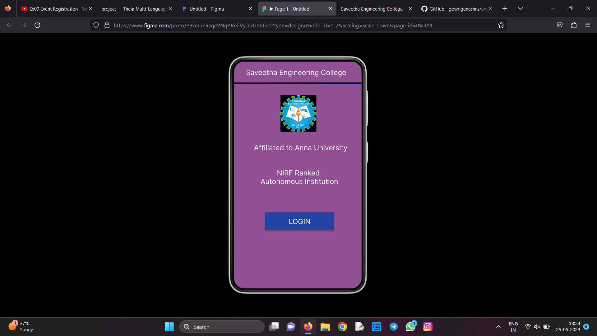
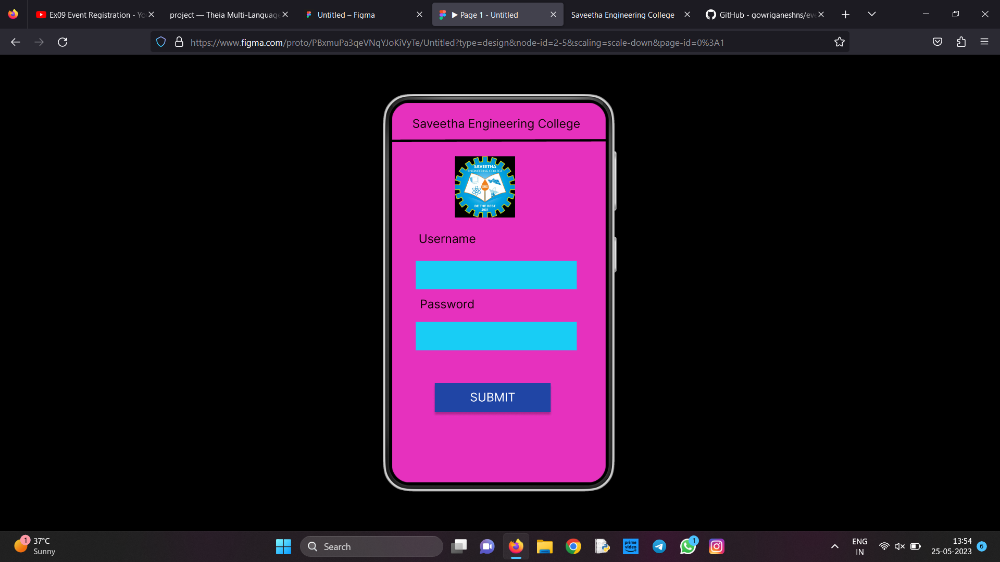
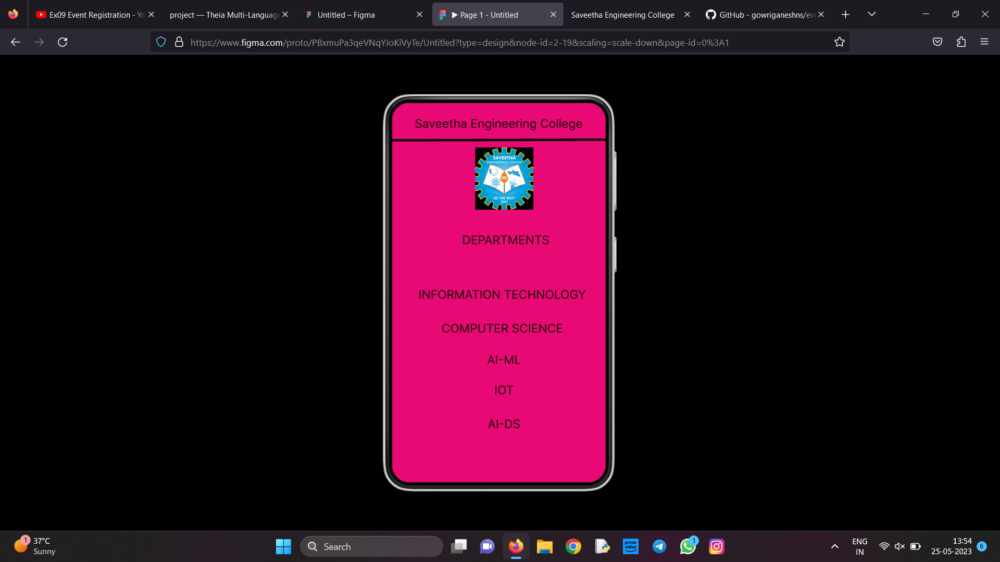

# Event Registration Web Application

## AIM:
To design, develop and deploy a web application for event registration.

## DESIGN STEPS:

### Step 1:
Create a new frame.

### Step 2:
Select any one present size on your choice.

### Step 3:
Select the shape you need.

### Step 4:
Import image as need.

### Step 5:
Create pages based on your need and link them.

### Step 6:

Validate the HTML and CSS code.

### Step 6:

Publish the website in the given URL.

## DESIGN:
Figma
## PROGRAM :
```
/* Home page */

position: relative;
width: 360px;
height: 640px;

background: #915093;


/* Android Small - 1 */

position: relative;
width: 360px;
height: 640px;

background: linear-gradient(0deg, #E631BE, #E631BE), #E631BE;


/* Saveetha Engineering College */

position: absolute;
width: 283px;
height: 48px;
left: 38px;
top: 23px;

font-family: 'Inter';
font-style: normal;
font-weight: 400;
font-size: 20px;
line-height: 24px;
text-align: center;

color: #120404;


/* DEPARTMENTS */

position: absolute;
width: 191px;
height: 41px;
left: 96px;
top: 219px;

font-family: 'Inter';
font-style: normal;
font-weight: 400;
font-size: 20px;
line-height: 24px;
text-align: center;

color: #120404;


/* INFORMATION TECHNOLOGY */

position: absolute;
width: 323px;
height: 53px;
left: 24px;
top: 311px;

font-family: 'Inter';
font-style: normal;
font-weight: 400;
font-size: 20px;
line-height: 24px;
text-align: center;

color: #120404;


/* COMPUTER SCIENCE */

position: absolute;
width: 323px;
height: 53px;
left: 24px;
top: 368px;

font-family: 'Inter';
font-style: normal;
font-weight: 400;
font-size: 20px;
line-height: 24px;
text-align: center;

color: #120404;


/* AI-ML */

position: absolute;
width: 323px;
height: 53px;
left: 27px;
top: 421px;

font-family: 'Inter';
font-style: normal;
font-weight: 400;
font-size: 20px;
line-height: 24px;
text-align: center;

color: #120404;


/* IOT */

position: absolute;
width: 323px;
height: 53px;
left: 27px;
top: 472px;

font-family: 'Inter';
font-style: normal;
font-weight: 400;
font-size: 20px;
line-height: 24px;
text-align: center;

color: #120404;


/* AI-DS */

position: absolute;
width: 323px;
height: 53px;
left: 27px;
top: 529px;

font-family: 'Inter';
font-style: normal;
font-weight: 400;
font-size: 20px;
line-height: 24px;
text-align: center;

color: #120404;


/* Line 5 */

position: absolute;
width: 360px;
height: 0px;
left: 0px;
top: 65.04px;

border: 4px solid #000000;
transform: rotate(-0.17deg);


/* logo 3 */

position: absolute;
width: 98px;
height: 105px;
left: 140px;
top: 75px;

background: url(logo);

```

## OUTPUT:





## Result:

The program to design ,develop and deploy a web application for event registration is completed successfully